# 计算机系统2

罗秋明老师

平时期末四六开

第二章：数据的表示和运算 new int[]{233}

第三章：各类语句的转换与表示，各类复杂数据类型的转换表示，函数调用的转换表示 for( ; ; )  int a[1]   println()

第七章：链接linker与加载,程序执行，存储器访问

第八章：异常和中断处理

## 三个主题

- 表示representation:高级语言如何在汇编中表示

- 转换translation:高级语言对应机器级代码.关键是for循环函数调用等重量级语句

- 执行控制流control flow:程序并发,逻辑控制流的异常事件及处理,IO

一个格式:elf格式->链接->进程映像

期末闭卷

实验:要求学生假设一个LINUX/IA32或LINUX/IA64的计算机系统balabala

# Chapter 1

### 1.1 数据及其解读

### 1.2 编译链接全过程

.c 预处理 .i 编译器 .s 汇编器 .o 链接器 最终出来才是可执行

​    gcc -E    gcc -S  gcc -c   gcc

objdump -d xxxx.o 反汇编

#### 优化程序性能

- switch 跟 ifelse 效率

- 函数调用的开销

- while跟for

- 指针引用和数组索引

处理链接时出现的错误:大型开源软件在编译时出现库不完整的情况

### 1.3 指令的执行

#### 硬件

- CPU-北桥芯片-Main Memory

- 北桥芯片-I/O PCI总线,接USB 显卡硬盘等

### 1.4  存储设备的层次结构

速度差的问题,数据使用呈现局部性

解:缓存

### 1.5 OS

OS不怎么讲。作用是向应用提供简单一致的接口来操作硬件。

抽象：进程 虚拟内存 文件系统

进程:对正在运行的一个程序的抽象

线程:资源和调度的分离.线程的资源开销比进程小,切换比进程快

避免内存碎片化,以免空间很大还分不出来

虚拟内存通过与页层映射到物理内存

文件

### 1.6 计算机系统间协作

​     网络接口 ,网络协议不讲…

### 1.7 并行技术

同时性 simultaneity 多个事件同时发生

并发 concurrency 一个同时具有多个活动的系统

并行 parallelism 包含同时性和并发

超线程: 普通核上线程切换需要20000个时钟周期???超多线程一个时钟周期

# Chapter 2 信息表示和处理 必考

### 2.1 信息存储

字 用于指明整数和指针数据的**标称大小**. 属于硬件概念,常见有32位和64位

指针因为32位64位,所以跨平台的时候会有问题

指定编译器选项

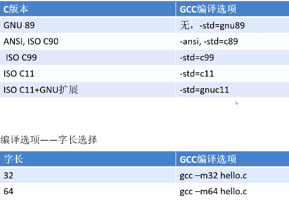

寻址:以其最低字节的地址为寻址地址

大端: 高位放在低地址,从低地址开始读.小端法相反.  计系3学的会有大端

浮点数在计系123都会考

注意位移运算!!注意符号

### 2.2 正数表示

计系2要考虑边界.32位不看,直接看64位.不用去背21xxxx,还有92xxxxxx,直接用2的多少次方表示就行

整数编码 原码 B2U(X)=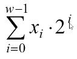Binary to Unsigned

其它的……MD看书吧

强制类型转换不改变位模式

c语言中数字最后加个u就是无符号数，不写默认是有符号

有符号和无符号比较时，c编译器会将有符号转为无符号

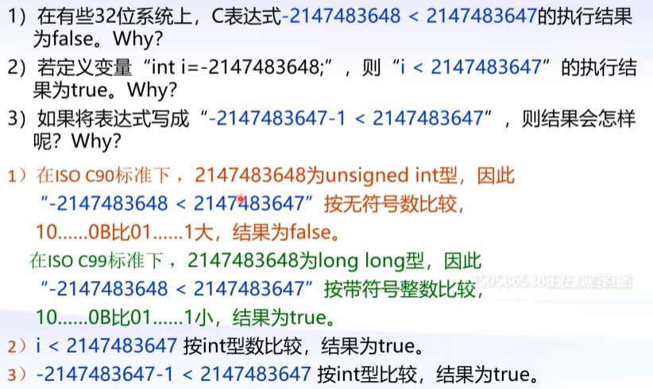

#### 扩展与截断

- 扩展
  - 从w位 到w+k位保持的数值不变
  - 无符号数转为更大的数据类型: 零扩展: 高位补0
  - 高位符号扩展: 高位添加符号位?正数0负数1
- 截断
  - 无符号: 就是,截断咯.截为k位,即x’ = x mod 2^k
  - 有符号: (待补充)

	### 2.3 整数运算

无符号数好办,考虑溢出就行. 判断方法是,用求和的结果跟任意一个加数比较大小

加法逆元: 跟原数相加等于0的

有符号数(补码)加法: 也使用无符号加法器

#### 乘法

无符号:w位,x*y=(x*y)mod 2^w 

有符号补码:w位,x*y=U2T((x*y)mod 2^w)

乘以常数: 将常数分为2的幂的和,再进行几次左移位。也可以左移几位再减另一个左移几位。如14=8+4+2=16-2

### 2.4 浮点数

只能近似表示,不能精确表示

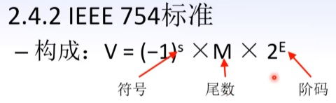

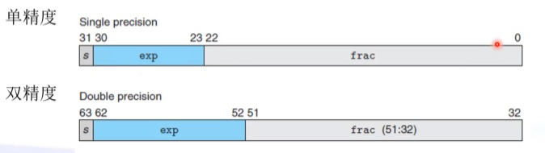

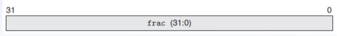

- 非规格化：阶码全0

- 无穷大： 阶码全1，尾数全0

- 非数：阶码全1，位数不全为0

考试考8位6位9位浮点数，不会太长，老师自己都数不过来

#### 小数的舍入

向偶数舍入 Round-to-even: 1先看往哪边舍入误差小。2如果在中点.5都一样，那么就往偶数走

向0舍入 Round-to-zero: 往0走

Round-to-down: 向下舍

Round-to-up 向上舍入

#### 整数和浮点数转换

int->float 不会溢出，可能被舍入

 int/float->double 准确表示

double->float 可能溢出可能舍入

float/double->int 可能溢出。如果需要舍入是向零舍入

# Chapter 3 程序的机器级表示

### 3.1程序编码

ISA 定义了指令格式功能寄存器存储器IO等结构。零一抽象是虚存

IA32是x86_64的前身。

考试考64位

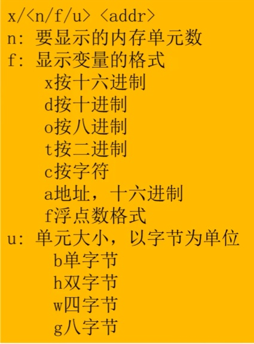

加点是伪指令，是给编译器用的

Intel 一个字16bit

x86 8个通用寄存器，32位

#### 数据格式

在汇编中，word是指一个short,2Byte.

不同数据类型，在汇编中的后缀不同

寄存器要记，除了栈指针只能用POP, PUSH

### 3.2 汇编中访问数据

立即数：以$开头

寄存器：以%开头

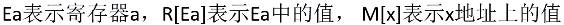

#### 数据传送指令

##### mov

等大小: 如果是立即数,只允许传送32位立即数.如果有64位的话, 只能moveabsq 绝对四字传送

不等大小:用符号扩展或者零号扩展. 扩展的操作数只能是寄存器

push 和 pop 可以理解为两步mov执行. 精简指令集中没有pop push 都是用push

### 3.3 算数与逻辑操作

加载有效地址：lea

一元操作

- inc ++
- dec--
- neg-
- not

二元操作

- add
- sub
- imul
- xor
- or 
- and

位移操作

- sal

- shl

- sar

- shr           

rl表左右，ah表算术和逻辑，移位量是立即数或者是%cl

特殊算术操作: 两个32位的全64位乘积和两个64位的全128位乘积。单操作数，另一个隐藏

课本上除法这里有问题

### 3.4 控制

条件码：CF， ZF，SF，OF

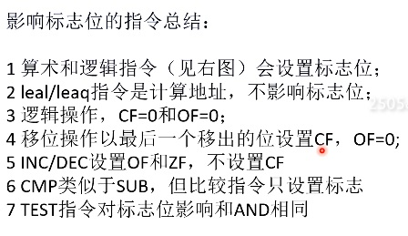

跳转指令

if else 的汇编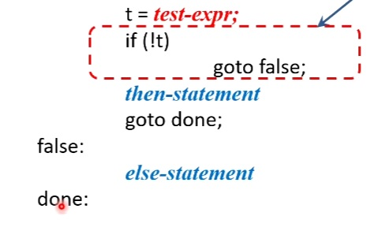可以使用if goto 来替代

与&&可以转为多个if来解决。即一个if变成多个if

条件传送

#### 循环

do while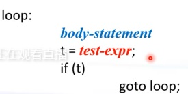

while有两种：jump to middle   guarded-do

for里面如果有continue的话,转成while结构,continue需要用goto跳到循环结束后执行的部分

switch:当if的条件可以转化为编码时，if和switch可以互相替换，但效率不同

跳转表

考试考正向反向转换

### 3.5 过程

栈帧重点考

寄存器使用惯例也是！！

P上级函数，Q下级函数。P调用Q并从Q返回信息到P

#### 栈帧

一个过程调用所分配的那部分栈空间 叫 栈帧

栈顶由rsp指出

栈帧起点固定

叶子过程：Q不再往下调用了。可能无需单独栈帧

参数传递/寄存器使用惯例

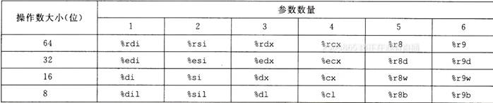

超过6个就用堆栈**(每个用8字节)**

有b的，和r12~r15，属于调用者保存寄存器。现场恢复，要保存这6个寄存器

栈上的局部变量。调用的函数入口处要将寄存器保存，结束前再恢复回去。有明确地址的，就必须放在栈帧中，不能寄存器——————总的来说就是寄存器数量不够

局部变量就不像参数一样要用满8字节来存

### 3.6 数组 结构 联合体

数组：多个标量聚集成更大的数据类型

多重数组(嵌套)   对于D\[R\]\[C\], D\[i\]\[j\]的内存是Xd+L(Ci+j)   L是数据大小

定长数组和变长数组

结构体  数据对齐：任何K字节基本对象的地址必须是K的倍数

联合体 不同类型的多个对象聚合到一个数据对象中,各对象占用的空间重叠

#### 访问越界和缓冲区溢出

C对数组引用不进行越界检查

避免使用gets，使用fgets。同样的，strcpy, strcat,sprintf都存在这样的问题

劫持返回地址

##### 解

- 栈随机化: 栈地点随机化
  - 随机化后的攻击——空雪橇

- 栈破坏检测: 哨兵(canary 金丝雀)。在数据缓冲区后

- 限制可执行区

变长栈帧：变长数组，或者alloca()在栈上分配空间

# Chapter 7 Link

- ELF: 可执行可链接格式 
  		- 节(包含头，程序头表)+节头部表

### 符号类型

- 全局符号：非静态的函数(普通函数)，普通的全局变量

- 外部符号：本模块引用，其它模块中定义的

- 本地符号：带static或全局变量(局部变量加static后存储属性变了，就存在堆区而不是栈区了)

三个环节：布局，符号解析，重定位

局部变量指存储空间在栈上，跟生成链接文件无关

COMMON

.bss block storage start, 未初始化的静态变量，以及初始化为0 的全局/静态变量

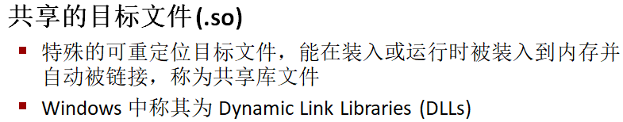

符号的强弱：函数和带初始化的全局变量为强，未初始化的全局变量是弱符号

多重定义的处理原则

1. 不允许多个强符号

2. 一个强+多弱，选择强符号

3. 多弱，随便选一个

静态库: 将多个可重定位目标文件打包

#### 静态库解析过程

三个集合

- E(可重定位模块集合，将复制到可执行文件中)
- U(随着链接展开而发现未解析的符号集合.成功链接的话该集合为空)
- D(所有输入文件中定义的符号集合)

.a包含很多个.o，不是所有.o都会被放入集合。但编译时一个.o一定会放入集合

两个库互相依赖：

1. 将两个库归档成一个 
2. 重复放

#### 重定位

开始内存布局

重定位条目：

- offset表示本节在最终的偏移
- type判断32还是64，绝对还是相对
- addend修正值(有时pc值不够)

重定位类型：PC相对地址(用户代码不超过2GB的)，32位绝对地址

refptr 需要填偏移地址的地方

被调用地址 - 调用的位置

ELF的入口地址不是main, 而是初始化(启动代码)代码所在的地址.

#### 静态链接讲完啦 开始动态链接

##### 静态的不足

- (资源重复占用)公共代码被反复复制, 浪费内存空间
- 库的更新, 需要将整个工程全部重新编译

windows中叫dll, linux中叫so

可以加载到进程内存任意位置

需要个动态链接器

so/dll库中的数据, 是进程私有的, 不共享. 因为进程映像互相独立, 只共享函数/方法. 除非明确向系统提出进程间共享某数据内存(这里不归这门课管)

创建及使用: (待补充)

运行前加载, 运行时加载

PIC: Position-Independent Code 位置无关代码

模块引用自己的内部符号: 装入内存后内部相对地址固定

模块引用外部符号: